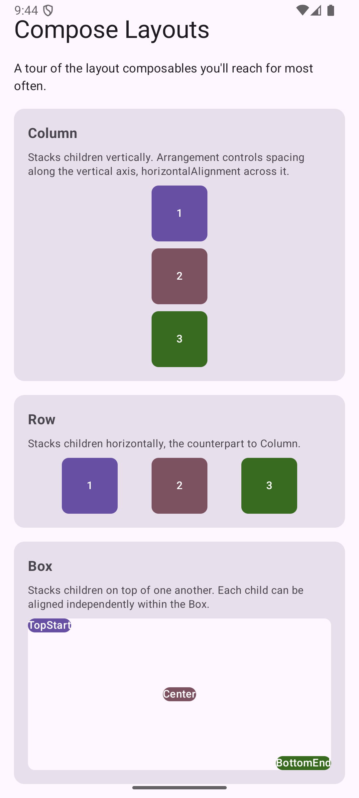

# Compose Layouts

A scrollable catalog of the core [Jetpack Compose](https://developer.android.com/develop/ui/compose)
layout composables, each shown in its own labeled section: `Column`, `Row`, `Box`, a
weighted `Row`, `LazyRow`, and `LazyColumn`. No navigation, no state — just enough of
each layout to see how it arranges its children.

## What it demonstrates

Everything lives in one file:
[`MainActivity.kt`](src/main/java/com/scttech/android/kotlin/samples/composelayouts/MainActivity.kt).

| Concept | Where | What it does |
| --- | --- | --- |
| `Column` | `ColumnDemo` | Stacks children top to bottom. `verticalArrangement` spaces them along the column's axis; `horizontalAlignment` positions them across it. |
| `Row` | `RowDemo` | The horizontal counterpart to `Column`; `horizontalArrangement` spaces children left to right. |
| `Box` | `BoxDemo` | Stacks children on top of one another. Each child is positioned independently with `Modifier.align(...)` on its own `Alignment`. |
| `Modifier.weight()` | `WeightedRowDemo` | Used inside a `Row`/`Column`, it divides the remaining space between siblings proportionally — similar to CSS flex-grow. A `weight(2f)` sibling ends up twice as wide as a `weight(1f)` one. |
| `LazyRow` / `LazyColumn` | `LazyRowDemo`, `LazyColumnDemo` | Scrolling list layouts that only compose and lay out the items currently visible on screen (plus a small buffer), instead of all items at once like a plain `Row`/`Column` would. Built with the `items(...)` DSL from a backing `List`. |
| `Arrangement` / `Alignment` | throughout | The two parameters that control spacing (`Arrangement`) and positioning (`Alignment`) in every layout above. |
| `@Preview` | `ComposeLayoutsPreview` | Renders the full catalog in Android Studio's **Design** tab without running the app. |

## Design notes

- `LayoutSection` is a small private composable that wraps each demo in a titled `Card`,
  so adding a new layout example to the catalog means adding one more `LayoutSection { }`
  call rather than repeating title/description boilerplate.
- `LabeledBox` is a private composable used as a stand-in "content block" (a colored,
  labeled square) across every demo, so the layout behavior — not the content — stays
  the focus. It takes a default `Modifier.size(64.dp)` that callers can override, e.g. to
  stretch a box to fill a weighted `Row` cell.
- The outer screen is wrapped in `Modifier.verticalScroll(rememberScrollState())` so the
  whole catalog scrolls as one page; the `LazyColumn` demo is given a fixed
  `Modifier.height(180.dp)` so it can live inside that outer scrollable `Column` without
  the two competing over unbounded vertical space.

## Try it yourself

- Change `Arrangement.SpaceEvenly` in `RowDemo` to `Arrangement.SpaceBetween` or
  `Arrangement.SpaceAround` and see how the spacing changes.
- Add a fourth child to `WeightedRowDemo` with `weight(3f)` and watch it take half the row.
- Swap `LazyColumnDemo`'s fixed height for `Modifier.fillMaxWidth()` only, and see why
  Compose throws — a `LazyColumn` needs bounded height when nested in another
  scrollable container.
