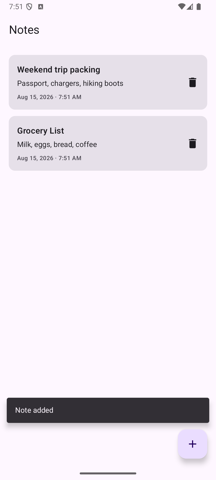

# Notes Database

A single-screen notes app — create, read, update, and delete notes backed by a real
on-device SQLite database via [Room](https://developer.android.com/training/data-storage/room).
Builds on [`login-form`](../login-form) by adding persistent state: notes survive app
restarts because they live in a database file, not just in-memory Compose state.

The default screen is empty; tap the **+** button to add your first note.

## What it demonstrates

This sample splits CRUD concerns into separate files — unlike the single-file
`hello-kotlin`/`login-form` samples, there's enough going on here (database, DAO,
ViewModel, UI) that keeping it in one file would hurt readability more than help it.

| File | Concept | What it does |
| --- | --- | --- |
| [`Note.kt`](src/main/java/com/scttech/android/kotlin/samples/notesdatabase/Note.kt) | `@Entity` | Defines the `notes` table. Each property becomes a column; `@PrimaryKey(autoGenerate = true)` lets SQLite assign the `id`. |
| [`NoteDao.kt`](src/main/java/com/scttech/android/kotlin/samples/notesdatabase/NoteDao.kt) | `@Dao` | The **C**reate/**R**ead/**U**pdate/**D**elete surface: `@Insert`, `@Update`, `@Delete`, and a `@Query` that reads the whole table back out. Room generates the SQL and the implementation at compile time. |
| `NoteDao.kt` | `Flow<List<Note>>` | The read query returns a `Flow` instead of a `List`. Room re-runs the query and emits a new list automatically whenever the `notes` table changes — the UI never has to manually refresh. |
| [`NotesDatabase.kt`](src/main/java/com/scttech/android/kotlin/samples/notesdatabase/NotesDatabase.kt) | `RoomDatabase` + `SQLiteDriver` | Declares the database and wires it to Android's native SQLite via `AndroidSQLiteDriver`. Built once and reused (a `synchronized` double-checked singleton) so the whole app shares one connection. |
| [`NotesViewModel.kt`](src/main/java/com/scttech/android/kotlin/samples/notesdatabase/NotesViewModel.kt) | `AndroidViewModel` + `StateFlow` | Owns the DAO and exposes the notes list as a lifecycle-aware `StateFlow`. All database writes happen in `viewModelScope.launch { }`, off the UI thread and safe across configuration changes. |
| [`MainActivity.kt`](src/main/java/com/scttech/android/kotlin/samples/notesdatabase/MainActivity.kt) | `ModalBottomSheet` | The add/edit form. The same composable and the same `onSave` callback handle both "new note" and "edit note" — which mode it's in depends on whether a `Note` was passed in. |
| `MainActivity.kt` | `SnackbarHostState` + `actionLabel` | Every write (add, update, delete) confirms itself with a `Snackbar`. Delete goes further and offers **Undo**, which just re-inserts the same `Note` — including its original `id`. |

## UX/UI

- **Delete is immediate, with Undo — not a confirmation dialog.** A blocking
  "Are you sure?" dialog interrupts the user's flow for every delete, even the ones
  they're sure about. Deleting immediately and offering a few seconds to undo is the
  standard Material pattern for reversible destructive actions, and it's less friction
  for the common case.
- **Empty state has real guidance**, not just a blank screen — "No notes yet. Tap the +
  button to add your first note." tells a first-time user exactly what to do next.
- **The bottom sheet form reuses one component for add and edit** so the interaction
  pattern for "work with a note" is consistent no matter which one the user is doing.
- **Notes are sorted by most-recently-updated**, so the note you just touched is always
  at the top — no hunting for it in a long list.
- **Title validation is inline** (`isError` + `supportingText`, the same pattern as
  `login-form`), so the error appears right where the problem is instead of in a toast
  or dialog far from the field.

## A note on Room's version

This sample uses **Room 3.0**, released just weeks before this sample was written (8/15/2026). It's
a significant rewrite: DAO functions are suspend-first, there's no more `Cursor` or
`SupportSQLiteDatabase`, and you now hand Room an explicit `SQLiteDriver`
(`AndroidSQLiteDriver` here) rather than letting it manage its own connection under the
hood. If you're following along with older Room tutorials online, expect the setup code
in `NotesDatabase.kt` to look different from what you'll find there — the DAO and
Entity annotations, however, work the same way they always have.

## Try it yourself

- Add a "pinned" `Boolean` column to `Note` and sort pinned notes to the top.
- Add a search `TextField` above the list that filters notes by title as you type.
- Swap the delete confirmation model: require a confirmation dialog for notes older
  than some age, but keep instant-delete-with-undo for new ones.
